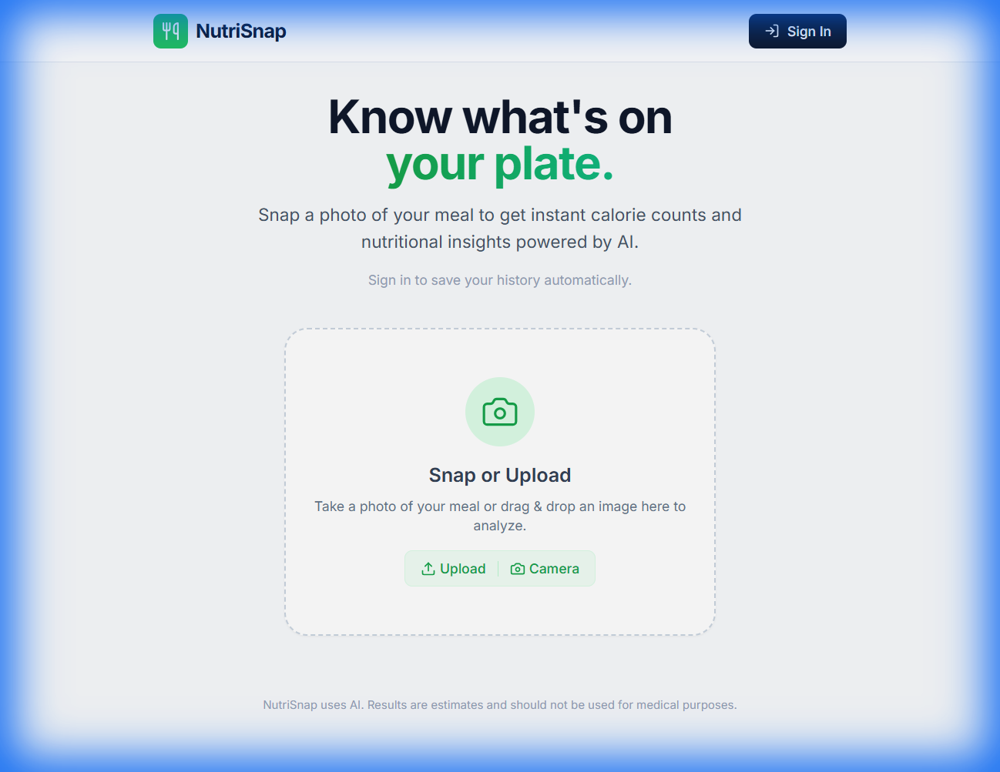

# NutriSnap - AI Calorie Counter 🥗

NutriSnap is a modern, AI-powered nutritional analysis application that helps you track what you eat with just a photo. Built with React, Vite, and Google's Gemini AI, it identifies food items, estimates portion sizes, and calculates calories and macronutrients instantly.



## 🚀 Features

*   **AI-Powered Analysis**: Uses Google's Gemini 2.5 Flash model to accurately identify food and calculate macros.
*   **Instant Nutrition Data**: Get details on Calories, Protein, Carbs, and Fat in seconds.
*   **Smart History**: Automatically saves your scan history to the cloud (Firestore).
*   **Daily Summary**: View your daily caloric intake and macro breakdown in a dynamic dashboard.
*   **Google Authentication**: Secure sign-in to keep your data private and accessible across devices.
*   **Progressive Web App (PWA)**: Installable on iOS and Android devices with offline capabilities.
*   **Responsive Design**: Beautifully designed interface that works perfectly on mobile and desktop.

## 🛠️ Tech Stack

*   **Frontend**: React, TypeScript, Vite
*   **Styling**: Tailwind CSS
*   **AI Model**: Google Gemini 1.5/2.5 Flash
*   **Backend / Auth**: Firebase (Authentication & Firestore)
*   **Deployment**: Ready for Render / Netlify / Vercel

## 📦 Installation

1.  **Clone the repository**
    ```bash
    git clone https://github.com/yourusername/nutrisnap.git
    cd nutrisnap
    ```

2.  **Install dependencies**
    ```bash
    npm install
    ```

3.  **Configure Environment Variables**
    Create a `.env` file in the root directory and add your keys:
    ```env
    GEMINI_API_KEY=your_google_gemini_api_key
    ```
    *Note: Firebase config is currently hardcoded in `services/firebase.ts`. For production, consider moving these to environment variables as well.*

4.  **Start the development server**
    ```bash
    npm run dev
    ```

## 📱 PWA Support

This app is fully PWA compliant.
*   **iOS**: Open in Safari -> Share -> "Add to Home Screen"
*   **Android**: Open in Chrome -> "Add to Home Screen"

## 🔒 Security

*   **Firestore Rules**: Configured to ensure users can strictly only access and modify their own data.
*   **Authentication**: Managed securely via Firebase Google Auth.

## 📄 License

MIT License - feel free to use this project for your own health and fitness journey!
